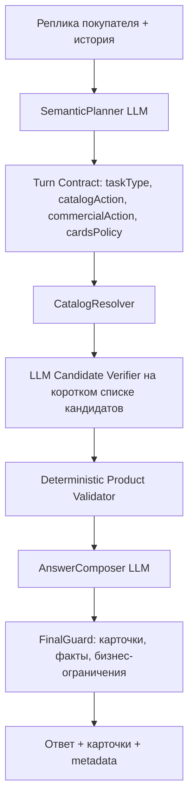

# План исправления агентности чата по прод-диалогу #876

Дата: 2026-05-12  
Диалог: `#876: Сравнить две модели двигателей Baudouin и Doosan`  
Источник анализа: продовый диалог, код проекта, обсуждение рисков исправлений.

## 1. Цель

Исправить поведение чата так, чтобы бот работал как AI-менеджер по продажам и поддержке, а не как набор сценарных правил:

- понимает смысл последней реплики в контексте диалога;
- различает чистую доставку, чистое наличие, подбор, подбор с коммерческим вопросом, сравнение и технический ответ;
- ищет товары в каталоге надежно до ответа `не вижу`;
- показывает карточки при подборе и не показывает их в чисто коммерческих/технических вопросах;
- не называет модель без видимой карточки или точного доказательства из каталога;
- не предлагает неподходящие товары, например `220/380`, когда покупатель запросил только `220`;
- не дублирует ответы при recovery;
- не превращает отказ от звонка в отказ от подбора.

Ключевой принцип: LLM принимает смысловые решения, код проверяет факты каталога, бизнес-ограничения и согласованность ответа.

## 2. Что произошло в диалоге #876

### 2.1. Что бот сделал хорошо

- Не стал выдумывать полноценное сравнение Baudouin и Doosan без конкретных моделей.
- Не обещал точную стоимость доставки и наличие.
- Не давил на телефон после отказа.
- Вежливо завершил диалог.

### 2.2. Что бот сделал плохо

- На первый запрос о сравнении двигателей recovery показал нерелевантные карточки: виброплиту Husqvarna и привод вибратора TSS.
- По запросу `Есть в наличии Тсс 10 кВт бензин?` бот несколько раз просил уточнить модель вместо самостоятельного поиска и подбора.
- После уточнения `220` бот продолжал задавать вопросы, хотя уже мог искать генераторы ТСС 8-10 кВт 220 В.
- На запрос `подобрать из наличия Тсс 8-10 кВт 220 и посчитать доставку` бот не показал карточки.
- Бот назвал модель `ТСС SGG 8000EH3NUA 220/380`, хотя покупатель указал `220`, и не показал карточку товара.
- Было два ответа ассистента на один `turnId`: recovered и completed.

## 3. Главная системная причина

В коде уже есть LLM-планировщик и `AgentTurnContract`, но часть смысловых решений все еще фактически принимается правилами, флагами карточек и recovery-логикой.

Проблемные связи:

1. LLM может понять ход как смешанный, но `cardsRole` легко становится `none`, потому что в prompt доставка/наличие описаны как причины не показывать карточки.
2. Если `leadAllowed=false`, код может превратить ход в обычный `answer_question`, хотя покупатель мог отказаться только от звонка, а не от подбора.
3. Полный проход по каталогу зависит от политики карточек. Если карточки запрещены, каталог может не быть проверен достаточно глубоко.
4. Recovery может самостоятельно подобрать карточки, не учитывая смысловой контракт основного хода.
5. Финальный ответ может назвать модель из внутренних кандидатов, даже если карточка не показана.

## 4. Проблемы и решения

## 4.1. Грубое разделение `cardsRole` ломает смешанные запросы

### Где в коде

- `src/ai/prompts.ts` около блока `agentDecision`.
- `src/ai/prompts.ts`: инструкция `cardsRole: none` для доставки, скидки, наличия, сервиса, технического сравнения и отказа от контакта.
- `src/ai/agentTurnContract.ts`: `coerceSemanticAgentDecision`.

### Как сейчас

LLM возвращает:

- `answerTask`;
- `cardsRole`;
- `leadAllowed`;
- `mustAnswerNow`.

Но prompt смешивает две разные вещи:

- есть ли в ходе коммерческий вопрос;
- нужны ли карточки для подбора.

Из-за этого запрос `подберите генератор и посчитайте доставку` может быть обработан как коммерческий вопрос без карточек.

### Почему это проблема правил вместо LLM

Правило `none для доставки/наличия` не понимает смысл фразы. Оно не различает:

- `сколько доставка?`;
- `подберите генератор и посчитайте доставку`;
- `есть в наличии ТСС 10 кВт?`;
- `что есть из ТСС 8-10 кВт 220?`.

Это смысловое решение должно принимать LLM.

### Решение

Расширить LLM-контракт хода:

```ts
type TaskType =
  | 'pure_delivery'
  | 'pure_availability'
  | 'product_selection'
  | 'product_selection_with_delivery'
  | 'product_selection_with_availability'
  | 'technical_answer'
  | 'comparison'
  | 'contact_refusal_continue_selection';

type CatalogAction =
  | 'none'
  | 'exact_model_lookup'
  | 'find_matching_products'
  | 'verify_catalog_absence';

type CommercialAction =
  | 'none'
  | 'explain_manager_required'
  | 'offer_contact_after_answer';

type ProductCardsPolicy =
  | 'none'
  | 'show_exact_matches'
  | 'show_matching_products'
  | 'supporting_only';
```

LLM должна возвращать не только `cardsRole`, а смысловую связку:

```json
{
  "taskType": "product_selection_with_delivery",
  "catalogAction": "find_matching_products",
  "commercialAction": "explain_manager_required",
  "productCardsPolicy": "show_matching_products",
  "leadAllowed": true
}
```

### Как будет после исправления

- `Сколько доставка до Ейска?` -> чистый коммерческий вопрос, карточек нет.
- `Подберите ТСС 8-10 кВт 220 и посчитайте доставку` -> подбор с карточками, доставка отдельным честным блоком.
- `Есть в наличии ТСС 10 кВт бензин?` -> проверка каталога/подбор близких моделей, точное наличие не обещается.

## 4.2. `leadAllowed=false` сейчас может выключить подбор

### Где в коде

- `src/ai/agentTurnContract.ts`, функция `applyAgentTurnContractToPlan`.
- Ветка `if (!contract.leadAllowed)`.

### Как сейчас

Если покупатель не хочет звонок/форму, код может выставить:

```ts
action: 'answer_question'
```

Даже если ход по смыслу является подбором товара.

### Почему это проблема правил вместо LLM

Отказ от звонка не означает отказ от подбора. Сейчас код делает слишком грубое действие на основе одного флага.

### Решение

Разделить:

- `leadAllowed`: можно ли просить контакт;
- `catalogAction`: надо ли искать товар;
- `productCardsPolicy`: надо ли показывать карточки;
- `commercialAction`: надо ли объяснить передачу менеджеру/логистике.

`leadAllowed=false` должен запрещать только сбор контакта как главный шаг. Он не должен менять `product_selection` на `answer_question`.

### Как будет после исправления

Покупатель: `Нет, просто подберите`.  
Бот: продолжает подбор и показывает карточки, но не просит телефон основным действием.

## 4.3. Каталог может быть проверен не полностью перед `не вижу`

### Где в коде

- `src/ai/assistant.ts`, `findProducts`.
- `src/ai/assistant.ts`, `selectProductsForTurn`.
- `src/ai/assistant.ts`, `findStructuredCatalogSlice`.

### Как сейчас

Поиск идет через:

- exact model tokens;
- text search;
- supplemental queries;
- vector search;
- иногда full catalog slice.

Но full catalog slice зависит от:

- `plan.cardPolicy !== 'textOnly'`;
- `contract.render.cards !== 'none'`;
- `catalogShortlistTurn`.

Если LLM/контракт запретили карточки, код может не сделать полный структурированный проход по каталогу. Тогда бот может написать `не вижу`, хотя товар есть.

### Почему это проблема правил вместо LLM

Показ карточек и проверка наличия товара в каталоге сейчас связаны технически. Это разные действия:

- `искать/проверить товар в каталоге`;
- `показывать карточку покупателю`.

Первое должно запускаться по смыслу запроса, который определяет LLM. Второе зависит от роли карточек в ответе.

### Решение

Добавить слой `CatalogResolver`.

Пайплайн:

```txt
SemanticPlanner LLM
-> CatalogResolver
-> LLM Candidate Verifier
-> Deterministic Product Validator
-> AnswerComposer LLM
-> FinalGuard
```

`CatalogResolver` запускается, если LLM вернула:

- `catalogAction='exact_model_lookup'`;
- `catalogAction='find_matching_products'`;
- `catalogAction='verify_catalog_absence'`.

Он не зависит от того, надо ли показывать карточки.

### Этапы `CatalogResolver`

1. Exact model lookup.
2. Нормализация модели/артикула:
   - без пробелов;
   - без дефисов;
   - без регистра;
   - с учетом кириллицы/латиницы.
3. Алиасы брендов:
   - `ТСС`;
   - `TSS`;
   - `Tss`;
   - типичные варианты написания.
4. PostgreSQL full-text/trigram search.
5. Vector search.
6. Structured full scan по:
   - классу товара;
   - бренду;
   - мощности;
   - фазности;
   - топливу;
   - типу генератора;
   - бюджету, если указан.
7. Last-chance LLM query expansion.

### Как использовать LLM на последнем этапе

LLM не получает весь каталог. Она получает только:

```json
{
  "userQuery": "Тсс 10 кВт бензин 220",
  "normalizedNeed": {
    "brand": "ТСС",
    "productClass": "generator",
    "fuel": "gasoline",
    "powerKwMin": 8,
    "powerKwMax": 10,
    "phase": "single_220"
  },
  "failedSearches": ["..."],
  "candidateHints": []
}
```

И возвращает 5-10 дополнительных запросов/алиасов:

```json
{
  "expandedQueries": [
    "TSS бензиновый генератор 8 кВт 220",
    "ТСС генератор 10 кВт однофазный",
    "SGG 8000 220",
    "SGG 10000 220"
  ],
  "reason": "buyer likely searches TSS gasoline single-phase generators near 8-10 kW"
}
```

### Как будет после исправления

Фраза `не вижу точного совпадения` разрешена только если:

```ts
catalogResolution.status === 'exhausted'
```

В metadata должно быть видно:

- какие поисковые этапы прошли;
- сколько кандидатов найдено;
- какие товары отклонены;
- почему они отклонены;
- был ли last-chance LLM query expansion.

## 4.4. `220` не должен показывать `220/380`, если покупатель не разрешал смешанную фазность

### Где в коде

- `src/ai/productClassifier.ts`: `singlePhaseTerms`.
- `src/ai/assistant.ts`: сбор `singlePhase220`.
- `src/ai/assistant.ts`: `productSelectionHardViolation`.
- `src/ai/assistant.ts`: `productFitPenalty`.

### Как сейчас

Код умеет заметить желание `220`, но не достаточно жестко запрещает `220/380` и трехфазные модели как hard violation.

В диалоге это привело к тому, что бот назвал модель `220/380`, хотя покупатель сказал `220`.

### Почему это не должно быть LLM-галлюцинацией

LLM должна определить смысл требования:

```json
{
  "phaseRequirement": "single_220_only"
}
```

Но факт товара проверяет код:

- товар чисто 220 В;
- товар 220/380;
- товар 380 В;
- данных о фазности не хватает.

Это deterministic validation, а не сценарный костыль.

### Решение

Ввести нормализованный профиль фазности товара:

```ts
type ProductPhaseProfile =
  | 'single_220'
  | 'mixed_220_380'
  | 'three_phase_380'
  | 'unknown';
```

Если LLM/selection state говорит `single_220_only`, то:

- `single_220` допускается;
- `mixed_220_380` отклоняется;
- `three_phase_380` отклоняется;
- `unknown` не рекомендуется как точное совпадение, но может попасть в диагностический список с причиной `phase unknown`.

### Как будет после исправления

Покупатель: `220`.  
Бот показывает только чистые 220 В модели.

Если в каталоге есть только `220/380`, бот пишет:

> Точных однофазных 220 В моделей по этим критериям не вижу. Есть близкие трехфазные/220-380 варианты, но я не буду рекомендовать их как подходящие под ваш запрос без подтверждения, что вам подходит 380 В.

## 4.5. Бот назвал модель без карточки

### Где в коде

- `src/ai/assistant.ts`: формирование `productCards`.
- `src/ai/assistant.ts`: `answerContext`.
- `src/ai/assistant.ts`: инструкция `If productCardsShown is empty, do not name any concrete model`.
- `src/ai/assistant.ts`: final answer repair/guard.

### Как сейчас

В prompt уже есть запрет на называние модели без карточки, но модель может попасть в ответ через:

- `answerGuidance`;
- `allSuitableProducts`;
- `catalogCandidates`;
- `productSelection`;
- внутренние metadata.

### Почему это проблема

Покупатель видит текст без карточки. Это выглядит как галлюцинация, даже если модель была где-то во внутреннем контексте.

### Решение

Добавить `AnswerEvidenceGuard`.

Правила guard:

- если модель названа как рекомендация, она должна быть в `productCardsShown`;
- если модель названа как `есть в каталоге`, она должна быть в `exactCatalogMatches`;
- если карточек нет и нет exact lookup, конкретные модели нельзя называть;
- если модель в `nearMisses`, ее можно назвать только как неподходящую с причиной отклонения.

Это не regex-костыль для конкретной модели. Это общий post-condition: текст ответа должен быть доказуемым из разрешенных источников.

### Как будет после исправления

Бот не сможет написать:

> Подойдет ТСС SGG 8000EH3NUA

если карточка не показана или модель не подтверждена exact lookup.

## 4.6. Recovery может добавлять нерелевантные карточки

### Где в коде

- `src/routes/chat.ts`: основной stream endpoint.
- `src/routes/chat.ts`: recover endpoint.
- `src/client/chatStream.ts`: клиентская логика recovery.
- `src/ai/assistant.ts`: `recoverTurn`.

### Как сейчас

Recovery может заново выбрать карточки по последнему тексту и не учитывать, что исходный LLM-контракт говорил `cardsRole=none`.

В диалоге #876 это проявилось как нерелевантные карточки к сравнению двигателей Baudouin/Doosan.

### Почему это проблема

Recovery должен восстанавливать ответ в рамках уже принятого смыслового решения, а не принимать новое решение по карточкам.

### Решение

Recovery обязан читать сохраненный:

- `turnContract`;
- `taskType`;
- `catalogAction`;
- `productCardsPolicy`;
- `selectedProductIds`.

Если контракт говорит:

```ts
catalogAction === 'none' || productCardsPolicy === 'none'
```

recovery не имеет права подбирать и показывать карточки.

Если контракт отсутствует, recovery отвечает текстом и не делает самостоятельный подбор карточек.

### Как будет после исправления

Сравнение Baudouin/Doosan без конкретных моделей не получит карточки виброплит или вибраторов даже при recovery.

## 4.7. Дублирование ответа из-за гонки main stream и recovery

### Где в коде

- `src/routes/chat.ts`: основной `/chat` stream.
- `src/routes/chat.ts`: `/recover`.
- `src/client/chatStream.ts`: запуск recovery при ошибке/idle.

### Как сейчас

Клиент может вызвать recovery, пока основной ответ еще генерируется. В результате один `turnId` получает два assistant message:

- recovered;
- completed.

### Решение

Добавить turn-level idempotency:

```ts
type TurnGenerationState =
  | 'generating'
  | 'recovering'
  | 'recovered'
  | 'completed'
  | 'superseded';
```

Правила:

- recovery не пишет финальный assistant message, если main generation еще активна;
- main generation перед сохранением проверяет, не был ли уже записан финальный ответ;
- если recovery уже отдала временный ответ, main либо обновляет этот же message, либо помечает recovery как `superseded`;
- для одного `turnId` может быть только один финальный assistant message.

### Как будет после исправления

Один пользовательский ход дает один финальный ответ. История не содержит конкурирующих версий.

## 4.8. Правила и regex должны остаться только в зоне фактов, а не смысла

### Где сейчас риск

- `src/ai/agentTurnContract.ts`: legacy fallback по regex.
- `src/ai/assistant.ts`: availability/current-lineup/catalog-shortlist helper logic.
- `src/ai/productClassifier.ts`: термины и признаки товара.

### Что нельзя делать

Нельзя чинить диалог #876 точечными условиями:

- если фраза содержит `доставка` и `подберите`, то показать карточки;
- если фраза содержит `220`, удалить все `380`;
- если бренд `Тсс`, заменить строку и повторить поиск;
- если нет карточек, regex-ом убрать названия моделей из ответа;
- если вопрос про Baudouin/Doosan, запретить карточки конкретно для этих слов.

Это будут новые костыли.

### Что можно делать

Допустимые deterministic-части:

- нормализация артикулов и моделей;
- нормализация брендов;
- проверка фазы товара;
- проверка мощности;
- проверка топлива;
- проверка класса товара;
- проверка видимости карточки;
- запрет обещать точное наличие, скидку, доставку, сроки;
- финальная проверка, что текст ответа подтвержден карточками/каталогом.

LLM должна решать:

- что покупатель хочет сейчас;
- является ли доставка главным вопросом или частью подбора;
- надо ли показывать карточки;
- просит ли покупатель наличие конкретной модели или подбор ассортимента;
- можно ли предлагать альтернативы;
- отказался ли покупатель от звонка или только не хочет оставлять контакт сейчас;
- какой следующий шаг естественный для менеджера.

## 5. Целевая архитектура



## 6. Как было и как будет

| Сценарий | Сейчас | После исправления |
|---|---|---|
| `Сравните Baudouin и Doosan` | Recovery может показать случайные карточки | Текстовый ответ без карточек, просит конкретные модели/критерии |
| `Есть в наличии ТСС 10 кВт бензин?` | Бот просит точную модель | Проверяет каталог, показывает подходящие/точные карточки, наличие не обещает |
| `220` | Уточнение может не стать жестким ограничением | Требование становится `single_220_only` |
| `ТСС 8-10 кВт 220 и доставка` | Может уйти в коммерческий handoff без карточек | Подбор с карточками + доставка через логистику |
| Товар есть, но retrieval не достал | Возможен ответ `не вижу` | `не вижу` только после exhausted `CatalogResolver` |
| Модель есть во внутреннем selection, но карточки нет | Бот может назвать модель | FinalGuard запрещает рекомендацию без карточки/evidence |
| Recovery срабатывает рядом с main stream | Два ответа на один ход | Один финальный ответ на `turnId` |

## 7. План внедрения

### Этап 1. Новый LLM-контракт хода

- Обновить schema планировщика.
- Добавить `taskType`, `catalogAction`, `commercialAction`, `productCardsPolicy`.
- Переписать prompt так, чтобы доставка/наличие не запрещали карточки автоматически.
- Сохранить backward compatibility со старым `answerTask/cardsRole` на переходный период.

Критерий готовности: LLM отдельно классифицирует чистую доставку и подбор с доставкой.

### Этап 2. Исправить применение контракта

- Изменить `applyAgentTurnContractToPlan`.
- `leadAllowed=false` больше не превращает подбор в `answer_question`.
- `catalogAction` управляет поиском.
- `productCardsPolicy` управляет показом карточек.

Критерий готовности: отказ от звонка не ломает подбор.

### Этап 3. Ввести `CatalogResolver`

- Вынести проверочный каталоговый слой из логики показа карточек.
- Запускать его по `catalogAction`, а не по `cardsRole`.
- Добавить stages trace в metadata.
- Добавить last-chance LLM query expansion без передачи большого каталога в LLM.

Критерий готовности: отрицательный ответ о товаре невозможен без `status='exhausted'`.

### Этап 4. Ввести phase validation

- Нормализовать фазность товара.
- При `single_220_only` отклонять `mixed_220_380` и `three_phase_380`.
- Сохранять rejected/nearMiss причины.

Критерий готовности: `220` не показывает `220/380`, если покупатель не разрешил смешанную фазность.

### Этап 5. Добавить `AnswerEvidenceGuard`

- Проверять финальный текст на соответствие разрешенным источникам:
  - `productCardsShown`;
  - `exactCatalogMatches`;
  - `nearMisses` только как отклоненные варианты.
- Запрещать рекомендации без карточки/evidence.

Критерий готовности: модель не может быть названа как рекомендация без карточки.

### Этап 6. Исправить recovery

- Recovery читает сохраненный turn contract.
- Recovery не подбирает карточки, если контракт запрещает каталог/карточки.
- Recovery не принимает новый смысловой контракт вместо основного.

Критерий готовности: recovery по сравнению Baudouin/Doosan не показывает товарные карточки.

### Этап 7. Добавить idempotency для turn

- Ввести состояние генерации turn.
- Гарантировать один финальный assistant message на один `turnId`.
- Разрулить конфликт main stream и recovery.

Критерий готовности: в истории нет двух completed/recovered ответов на один ход.

## 8. Тесты

### Unit/eval tests для LLM-контракта

Проверить классификацию:

- `Сколько доставка до Ейска?` -> `pure_delivery`, `catalogAction=none`, `cardsPolicy=none`.
- `Подберите ТСС 8-10 кВт 220 и посчитайте доставку` -> `product_selection_with_delivery`, `catalogAction=find_matching_products`, `cardsPolicy=show_matching_products`.
- `Есть в наличии ТСС 10 кВт бензин?` -> `product_selection_with_availability` или `pure_availability` с `exact_model_lookup/find_matching_products` в зависимости от конкретности модели.
- `Сравните Baudouin и Doosan` -> `comparison`, `catalogAction=none`, если моделей нет.

### Catalog tests

- Товар находится по `ТСС`, `TSS`, разному регистру.
- Товар находится по артикулу/модели без пробелов и дефисов.
- Last-chance LLM query expansion вызывается только после пустых deterministic стадий.
- `не вижу` разрешается только при `CatalogResolver.status='exhausted'`.

### Product validation tests

- `single_220_only` не пропускает `mixed_220_380`.
- `single_220_only` не пропускает `three_phase_380`.
- `unknown phase` не становится точной рекомендацией.

### Answer guard tests

- Нельзя назвать модель как рекомендацию, если ее нет в `productCardsShown`.
- Можно назвать exact model, если она есть в `exactCatalogMatches`.
- Можно назвать near miss только с причиной отклонения.

### Recovery tests

- Recovery не показывает карточки при `catalogAction=none`.
- Recovery не создает второй финальный ответ на тот же `turnId`.
- Main stream и recovery не пишут конкурирующие assistant messages.

## 9. Live-проверка

После изменений обязательно провести локальную живую проверку через UI на `localhost`.

Сценарий должен повторять смысл диалога #876, но каждый следующий ход надо писать после фактического ответа бота:

1. `Сравните две модели двигатель бадуин и дусан`
2. Если бот просит модели, перейти к наличию генератора.
3. `Есть в наличии Тсс 10 кВт бензин?`
4. Ответить на уточнение: `220`
5. Попросить подбор: `А что есть в наличии от 8 до 10 кВт?`
6. Если бот уточняет, сказать: `Подберите из наличия ТСС 8-10 кВт 220 и посчитайте доставку до Ейска`
7. Проверить, что карточки есть, `220/380` не рекомендованы, доставка не обещана точно.
8. Отказаться от звонка: `Нет, просто покажите варианты`
9. Проверить, что подбор продолжается без давления на контакт.

Протокол сохранить в `local-live-tests/*.local.md`.

## 10. Проверка, что не добавлены новые костыли

Перед завершением реализации проверить diff:

- нет новых условий под конкретную фразу из диалога #876;
- нет запретов под конкретные слова `Baudouin`, `Doosan`, `ТСС 10 кВт`, `Ейск`;
- нет смысловой маршрутизации через regex;
- regex используется только для нормализации/извлечения фактов;
- LLM-контракт принимает смысловое решение;
- deterministic-код только проверяет факты и бизнес-ограничения;
- metadata показывает, почему бот выбрал или отклонил товар.

## 11. Ожидаемый результат

После исправлений агентность станет лучше, потому что:

- LLM будет главным мозгом смыслового маршрута;
- код не будет подменять смысл грубыми ветками;
- каталог будет проверяться надежно перед отрицательным ответом;
- карточки будут появляться тогда, когда покупатель реально просит подбор;
- коммерческие ограничения сохранятся без потери подбора;
- ответ станет проверяемым: каждая рекомендованная модель должна быть видимой карточкой или точным catalog evidence;
- recovery перестанет менять смысл хода и создавать дубли.

Итоговая модель поведения: бот сначала понимает покупателя, затем проверяет факты, затем отвечает как менеджер, а не как набор частных сценариев.
